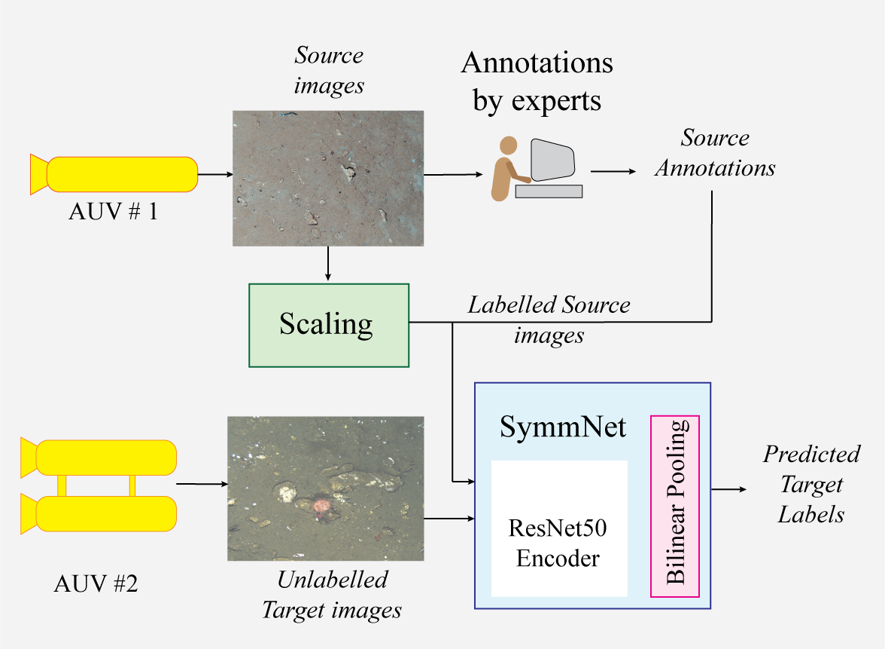

# Improved Benthic Classification using Resolution Scaling and SymmNet Unsupervised Domain Adaptation
Code release for paper "Improved Benthic Classification using Resolution Scaling and SymmNet Unsupervised Domain Adaptation", accepted to ICRA 2023, London.

[[Paper (pre-print)](https://arxiv.org/abs/2303.10960)]     [[Dataset](https://data.mendeley.com/datasets/d2yn52n9c9)]



This code is based on the original SymmNet code from the paper  [[Paper](https://zpascal.net/cvpr2019/Zhang_Domain-Symmetric_Networks_for_Adversarial_Domain_Adaptation_CVPR_2019_paper.pdf)] [[Code](https://github.com/Gorilla-Lab-SCUT/MultiClassDA)].  The code uses the SymmNetV1_solver from the SymmNet code base.

### Installation

This code is developed based on pytorch 1.10.1, CUDA 10.2 and python 3.8. Higher version pytorch should also work well.

We recommend using [conda](https://www.anaconda.com/distribution/) for installation:

```
conda env create -f benthic.yaml
conda activate benthic
```


### Dataset
The image data is from underwater surveys at the Elizabeth and Middleton Reefs, Australia and the South Hydrate Ridge.  The datasets can be downloaded from [this page](https://data.mendeley.com/datasets/d2yn52n9c9).

- Download the files `EMR.tar.gz` and `SHR.tar.gz`
- Extract the files to the `./dataset` directory eg.

```
mkdir dataset
cd dataset
tar -xzvf ~/Downloads/EMR.tar.gz
tar -xzvf ~/Downloads/SHR.tar.gz
```

The location of the dataset directory can be set in the yaml configuration file or by the command line under DATASET.DATAROOT.  See [Configuration](configuration).

### Execution
To run the code, ensure the python environment is setup, the dataset is downloaded and the location of the dataset is set using `DATASET.DATAROOT`.

Training can be executed using a script eg.

`./scripts/example_emr.sh`

### Configuration
Configuration for each experiment (eg target/source data combinations) is set in yaml files in the `experiments/config` directory.  A yaml file is provided for each source and target domain combination used in the paper.  Configuration options can be updated in the yaml file or in the command line.  The scripts for executing training used in the paper provide an example of how to update the configruation on the command line.

The default configuration for all training and model parameters, dataset, and other experiment variables is set in the `config/config.py` file.  

### Scripts
Scripts to execute the experimental results from the paper are found in './scripts' directory.  There is a script for each dataset being the Elizabeth and Middleton Reef (EMR) and the South Hydrate Ridge (SHR).  Each script iterates through each source and target combination for three different random seeds for six combinations being with or without scaling, SymmNet UDA and bilinear pooling.  The scripts are found in `scripts` directory.
### Logging
[Neptune.ai](https://neptune.ai/) has been implemented to log training data and results.  
  To enable neptune logging you will need a Neptune.ai account.  

To enable neptune logging, in the file `config/config.py`, set the following flags.
- NEPTUNE_LOGGING = True
- NEPTUNE.API_TOKEN = "xxxxxxx" # API token provided with your neptune account
- NEPTUNE.PROJECT = 'userid/project_name' # neptune project name

For more information on neptune.ai logging, please refer to the website [here](https://neptune.ai/).

## Citation
We would appreciate if you could cite this work as follows:

      @inproceedings{doig2023improved,
        title={Preprint: Improved Benthic Classification using Resolution Scaling and SymmNet Unsupervised Domain Adaptation},
        author={Doig, Heather and Pizarro, Oscar and Williams, Stefan B.},
        booktitle={Proceedings of the International Conference on Robotics and Automation},
        year={2023},
        eprint={2303.10960},
        archivePrefix={arXiv},
        primaryClass={cs.CV}
      }
    
If using the dataset, please use this citation:

    @techreport{doig2023dataset,
        title:{Dataset: Application of SymmNet Unsupervised Domain Adaptation and Resolution Scaling for Improved Benthic Classification},
        author={Doig, Heather and Pizarro, Oscar and Williams, Stefan},
        year={2023},
        doi={10.17632/d2yn52n9c9.3},
        publisher={Mendeley Data},
        version={V3}
      }


## Contact
For any queries or comments regarding this work, please contact Heather Doig by email (h.doig@acfr.usyd.edu.au)
